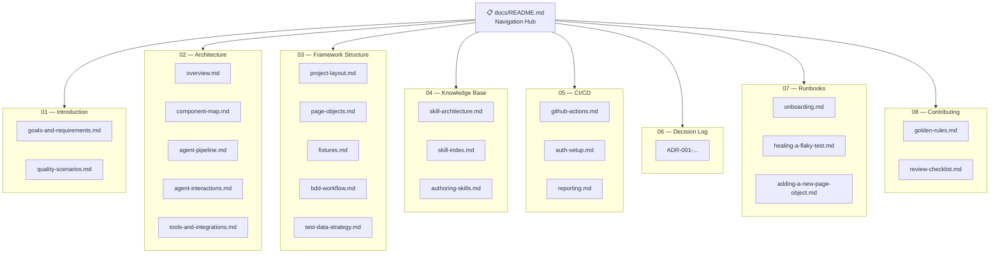

# Prompt: Navigation Hub

You are acting as the Certance technical writer. Generate the `docs/README.md`
navigation hub for this repository.

## Your steps

1. List all `.md` files in `docs/` recursively (excluding `node_modules`).
   Read the `title` and `audience` from each file's YAML frontmatter.

2. Build a mental map of the docs tree organised by arc42 section.

3. Write `docs/README.md` using this exact structure:

````markdown
---
title: 'Documentation Home'
section: 'Navigation'
audience: engineer
status: stable
last-updated: <YYYY-MM-DD>
---

# <Project Name> — Documentation

> This is the navigation hub for all framework documentation.
> Every section is reachable from this page. If a page is not linked here, it does not exist.

---

## Documentation map


````

---

## Section index

### 01 — Introduction

_Why the framework exists and what success looks like._

| Document                                                            | Audience            | Description                                      |
| ------------------------------------------------------------------- | ------------------- | ------------------------------------------------ |
| [Goals and requirements](01-introduction/goals-and-requirements.md) | leadership, qa-lead | Business context and quality objectives          |
| [Quality scenarios](01-introduction/quality-scenarios.md)           | qa-lead             | Measurable quality goals and acceptance criteria |

### 02 — Architecture

_How the system is designed and why._

| Document                                                            | Audience          | Description                                              |
| ------------------------------------------------------------------- | ----------------- | -------------------------------------------------------- |
| [Overview](02-architecture/overview.md)                             | all               | C4 Context diagram and system narrative                  |
| [Component map](02-architecture/component-map.md)                   | engineer, qa-lead | Internal structure: pages, fixtures, features, skills    |
| [Agent pipeline](02-architecture/agent-pipeline.md)                 | engineer          | Planner → Generator → Reviewer → Healer flow             |
| [Agent interactions](02-architecture/agent-interactions.md)         | engineer          | How humans work with each agent                          |
| [Tools and integrations](02-architecture/tools-and-integrations.md) | all               | Playwright, Claude Code, Copilot, Allure, GitHub Actions |

### 03 — Framework structure

_How to use the framework's components._

| Document                                                           | Audience | Description                                       |
| ------------------------------------------------------------------ | -------- | ------------------------------------------------- |
| [Project layout](03-framework-structure/project-layout.md)         | engineer | Directory map with purpose of each folder         |
| [Page Objects](03-framework-structure/page-objects.md)             | engineer | POM pattern, naming conventions, full class index |
| [Fixtures](03-framework-structure/fixtures.md)                     | engineer | Auth fixture, test data, shared setup             |
| [BDD workflow](03-framework-structure/bdd-workflow.md)             | engineer | Gherkin → step definitions → runner               |
| [Test data strategy](03-framework-structure/test-data-strategy.md) | engineer | Faker, PII rules, mocking boundaries              |

### 04 — Knowledge base

_The SKILL.md system and how to extend it._

| Document                                                      | Audience | Description                                         |
| ------------------------------------------------------------- | -------- | --------------------------------------------------- |
| [Skill architecture](04-knowledge-base/skill-architecture.md) | engineer | How SKILL.md files work and how agents consume them |
| [Skill index](04-knowledge-base/skill-index.md)               | engineer | All skills with links and purpose summaries         |
| [Authoring skills](04-knowledge-base/authoring-skills.md)     | engineer | How to write a new skill file                       |

### 05 — CI/CD

_Pipeline setup, auth state, and test reporting._

| Document                                     | Audience          | Description                                     |
| -------------------------------------------- | ----------------- | ----------------------------------------------- |
| [GitHub Actions](05-ci-cd/github-actions.md) | engineer          | Matrix strategy, job sequence, secrets setup    |
| [Auth setup](05-ci-cd/auth-setup.md)         | engineer          | STORAGE_STATE_BASE64 pattern and rotation       |
| [Reporting](05-ci-cd/reporting.md)           | engineer, qa-lead | Allure tags: epic / feature / severity taxonomy |

### 06 — Decision log

_Why the framework is designed the way it is._

| Document                      | Audience | Description                       |
| ----------------------------- | -------- | --------------------------------- |
| [ADR index](06-decision-log/) | engineer | All Architecture Decision Records |

### 07 — Runbooks

_Step-by-step procedures. Follow these without asking anyone._

| Document                                                            | Audience | Time    |
| ------------------------------------------------------------------- | -------- | ------- |
| [Onboarding](07-runbooks/onboarding.md)                             | engineer | ~30 min |
| [Healing a flaky test](07-runbooks/healing-a-flaky-test.md)         | engineer | ~15 min |
| [Adding a new Page Object](07-runbooks/adding-a-new-page-object.md) | engineer | ~20 min |

### 08 — Contributing

_Standards you must follow. No exceptions._

| Document                                                | Audience | Description                                       |
| ------------------------------------------------------- | -------- | ------------------------------------------------- |
| [Golden rules](08-contributing/golden-rules.md)         | engineer | Non-negotiable framework standards with ADR links |
| [Review checklist](08-contributing/review-checklist.md) | engineer | What reviewers enforce before merge               |

---

_Last updated: <date>. To regenerate this hub, run the `nav-hub` prompt._

```

4. After any section in the docs/ tree that does NOT yet have a corresponding file,
   add a row with `[NOT YET CREATED]` and status `🔴` so gaps are visible.

5. Self-audit:
   - Every existing `.md` file in `docs/` is linked in the index?
   - Mermaid diagram matches the actual section structure?
   - No dead links (file linked but doesn't exist)?

6. Report: "Navigation hub written to `docs/README.md`.
   <N> sections linked, <N> gaps flagged."
```
