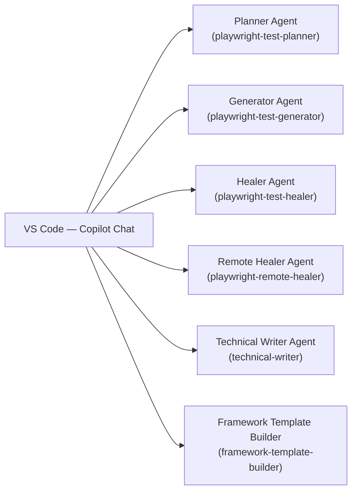
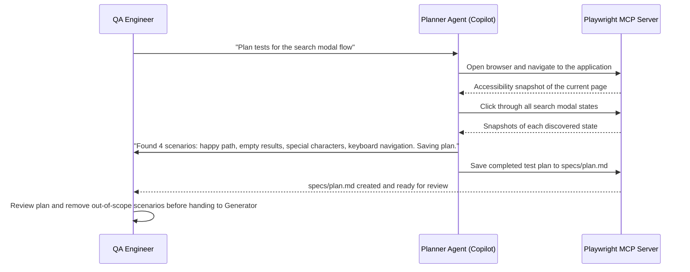
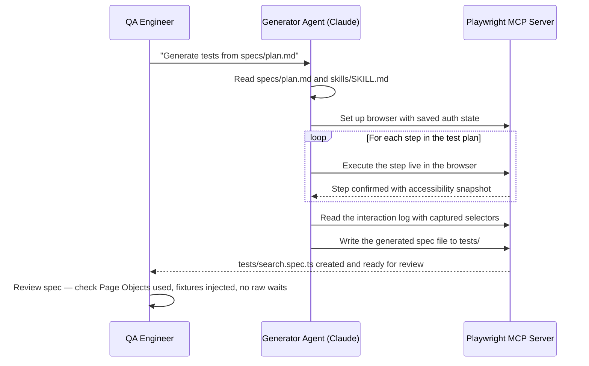
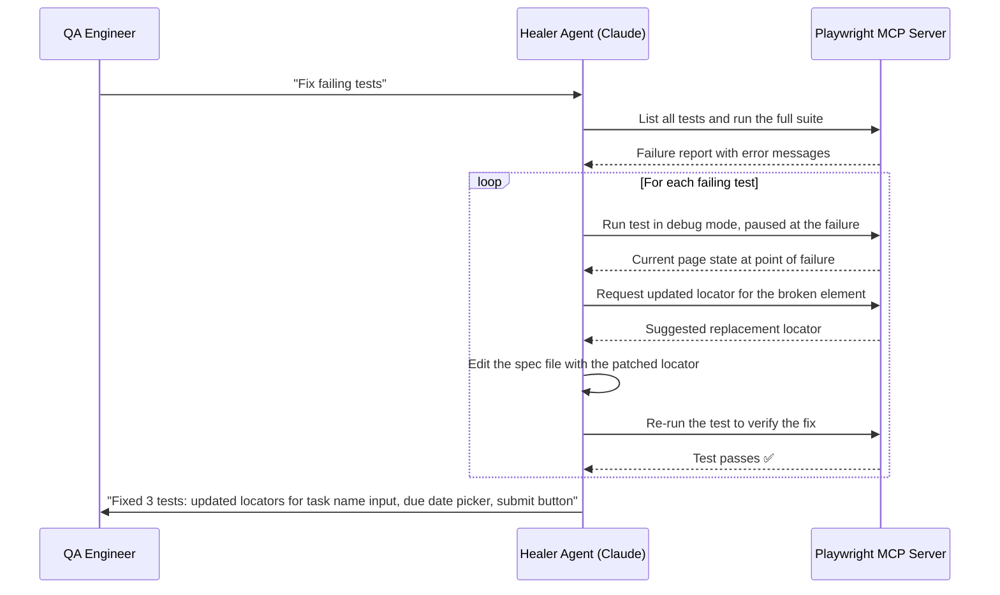
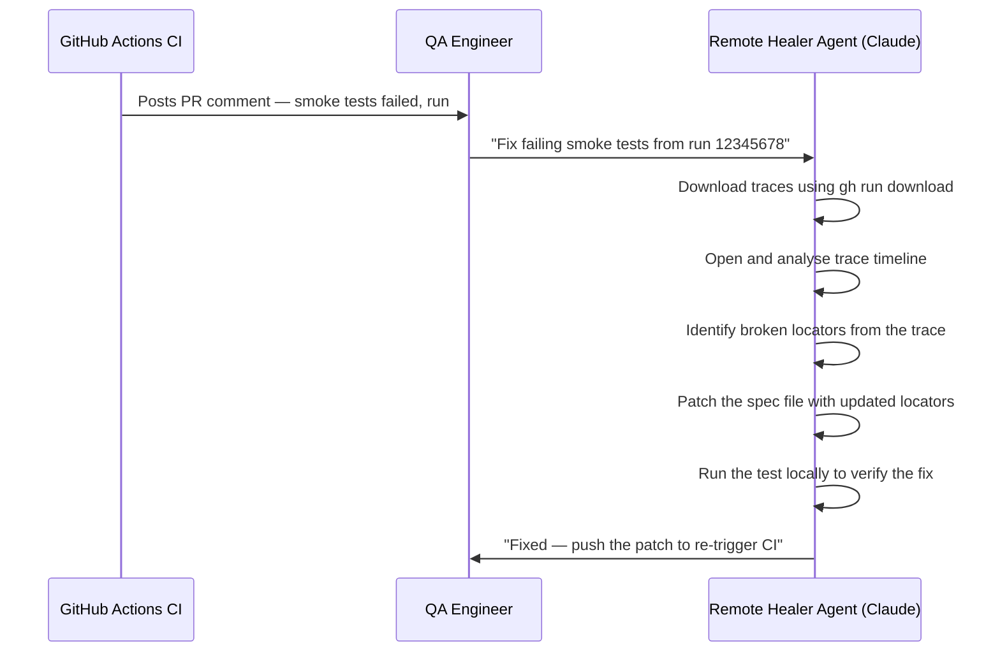

# Agent Interactions

> **Audience:** Engineers who use the agents daily in VS Code
> **TL;DR:** Each agent is invoked from Copilot Chat in VS Code using `@agent-name` syntax. This page shows exactly what to say to each agent, what to provide, and what to expect back.

## Overview

All agents run inside GitHub Copilot Chat in VS Code. The Playwright agents additionally require the Playwright MCP server to be running (it starts automatically via the `mcp-servers` config in each agent profile). You switch between agents by selecting them in the Copilot Chat agent picker — each brings its own toolset and constraints to the session.

---

## How to select an agent

In VS Code Copilot Chat, click the agent picker dropdown (shows `Copilot` by default) and select the agent by name. The agent profile loads, and every message in that session is handled by that agent.

---

## Agent: `playwright-test-planner`

**When to use:** You have a feature or user flow you want tested but no test plan yet. Provide a URL or describe the feature.

**What to provide:**

| Input                       | Example                                                                                           |
| --------------------------- | ------------------------------------------------------------------------------------------------- |
| A URL to explore            | `"Plan tests for https://app.example.com/tasks"`                                                  |
| A feature description       | `"Plan tests for the task creation flow: user opens modal, fills name, assigns to self, submits"` |
| An existing `.feature` file | `"Plan test scenarios to cover features/task-creation.feature more completely"`                   |

**What you get back:** A test plan saved to `specs/plan.md` with numbered scenarios, step-by-step instructions, expected outcomes, and starting state assumptions.

**Interaction pattern:**

**Review the plan before proceeding.** The Planner is thorough but may propose scenarios outside current scope. Edit `specs/plan.md` to remove or reprioritise before invoking the Generator.

---

## Agent: `playwright-test-generator`

**When to use:** You have a test plan (from the Planner or written manually) and want Playwright spec files generated from it.

**What to provide:**

| Input                      | Example                                                                |
| -------------------------- | ---------------------------------------------------------------------- |
| Point to the plan file     | `"Generate tests from specs/plan.md"`                                  |
| Specify a target spec file | `"Generate tests from specs/plan.md and save to tests/search.spec.ts"` |
| Scope to one scenario      | `"Generate only the 'empty results' scenario from specs/plan.md"`      |

**What you get back:** One `.spec.ts` file per scenario (or per test suite, depending on the plan structure), using Page Objects from `pages/`, fixtures from `fixtures/index.ts`, `getByRole()` locators, and web-first assertions.

**Interaction pattern:**

**Always review generated output before committing.** The Generator reads SKILL.md to enforce golden rules, but you are the final quality gate. Check that Page Objects are used (no raw `page.click()` in the spec), that fixtures are injected, and that assertions use `expect(locator).toBeVisible()` patterns.

---

## Agent: `playwright-test-healer`

**When to use:** Tests are failing locally or in CI. Provide the failing test name or let the agent discover all failures.

**What to provide:**

| Input                  | Example                                                       |
| ---------------------- | ------------------------------------------------------------- |
| Let it find failures   | `"Run all tests and fix any failures"`                        |
| Target a specific test | `"Fix the failing test 'should create a task with due date'"` |
| Provide a trace file   | `"Fix the test using trace at tmp/remote-traces/trace.zip"`   |

**What you get back:** Patched spec files with updated locators or corrected assertions. The agent commits the fix only after the test passes. If it cannot fix a test, it marks it `test.fixme()` with an explanatory comment.

**Interaction pattern:**

---

## Agent: `playwright-remote-healer`

**When to use:** The CI `bdd-smoke` job failed. The CI `heal-on-failure` job will have posted a comment on your PR (or opened an issue) with the run ID and trace download command.

**What to provide:**

| Input                          | Example                                          |
| ------------------------------ | ------------------------------------------------ |
| Run ID from CI failure comment | `"Fix failing smoke tests from run 12345678"`    |
| Direct trace path              | `"Fix tests using traces in tmp/remote-traces/"` |

**Interaction pattern:**

---

## Agent: `technical-writer`

**When to use:** Creating or updating documentation — architecture pages, ADRs, runbooks, Page Object docs, skill documentation.

**What to provide:**

| Input               | Example                                               |
| ------------------- | ----------------------------------------------------- |
| Documentation task  | `"Document the TodoPage class in pages/TodoPage.ts"`  |
| New design decision | `"Write an ADR for why we use storageState for auth"` |
| Runbook request     | `"Generate the onboarding runbook"`                   |
| Coverage report     | `"Audit documentation coverage for the framework"`    |

**What you get back:** A fully structured Markdown file in the correct `docs/` location, with YAML frontmatter, arc42 section mapping, Mermaid diagrams, and a `## Related` section.

---

## Common interaction mistakes to avoid

| Mistake                                        | Correct approach                                                                                           |
| ---------------------------------------------- | ---------------------------------------------------------------------------------------------------------- |
| Asking the Generator to explore the app        | That is the Planner's job — give Generator a plan file                                                     |
| Asking the Healer to write new tests           | The Healer only fixes existing tests — use Generator for new ones                                          |
| Asking the Technical Writer to edit TypeScript | It cannot and will not — use the Generator or Healer                                                       |
| Invoking agents without a test plan            | The Generator needs `specs/plan.md` — run the Planner first                                                |
| Committing generated tests without review      | Always review: check for `page.click()` in spec (should be in Page Object), raw waits, hardcoded selectors |

---

## Related

- [Agent pipeline](agent-pipeline.md) — the full sequence diagram of all four pipeline stages
- [Tools and integrations](tools-and-integrations.md) — MCP server setup, Copilot, Claude Code
- [Runbook: Healing a flaky test](../07-runbooks/healing-a-flaky-test.md) — step-by-step healing procedure
- [Runbook: Onboarding](../07-runbooks/onboarding.md) — getting set up with agents from scratch
