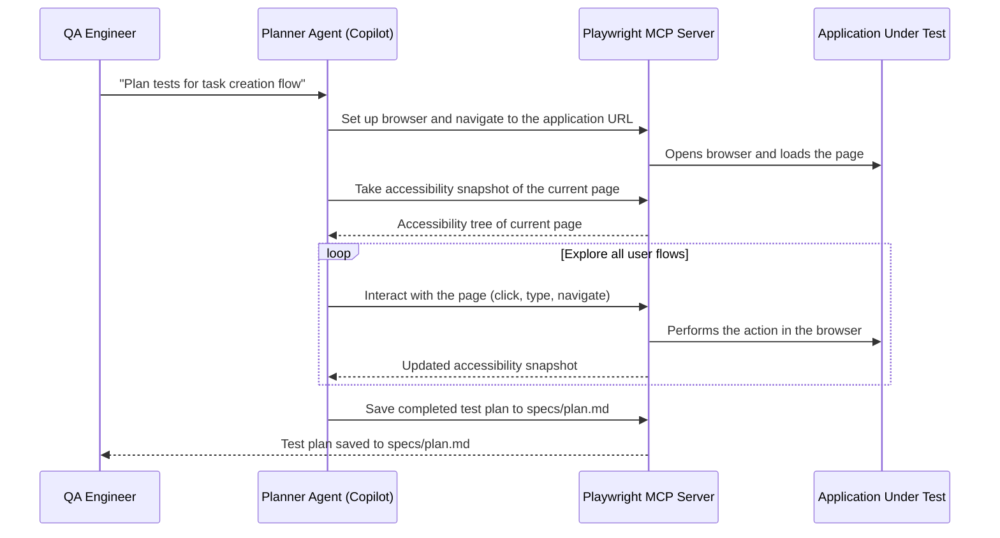
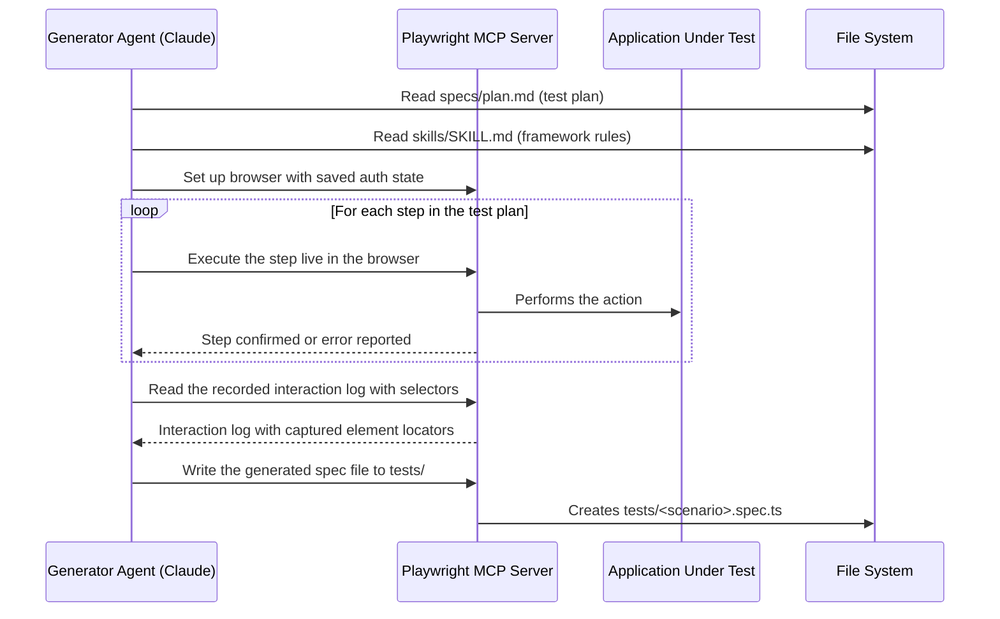
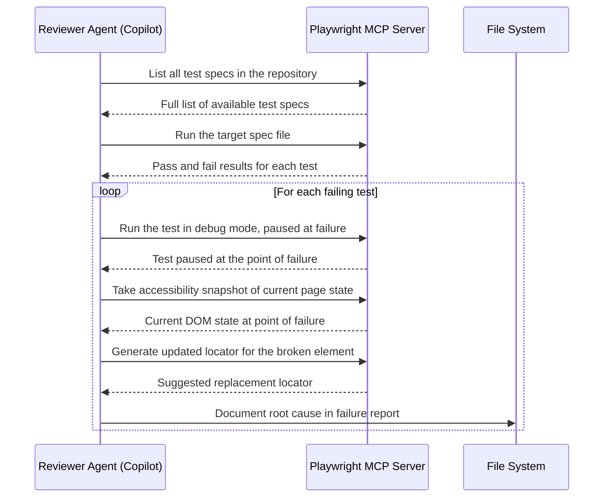
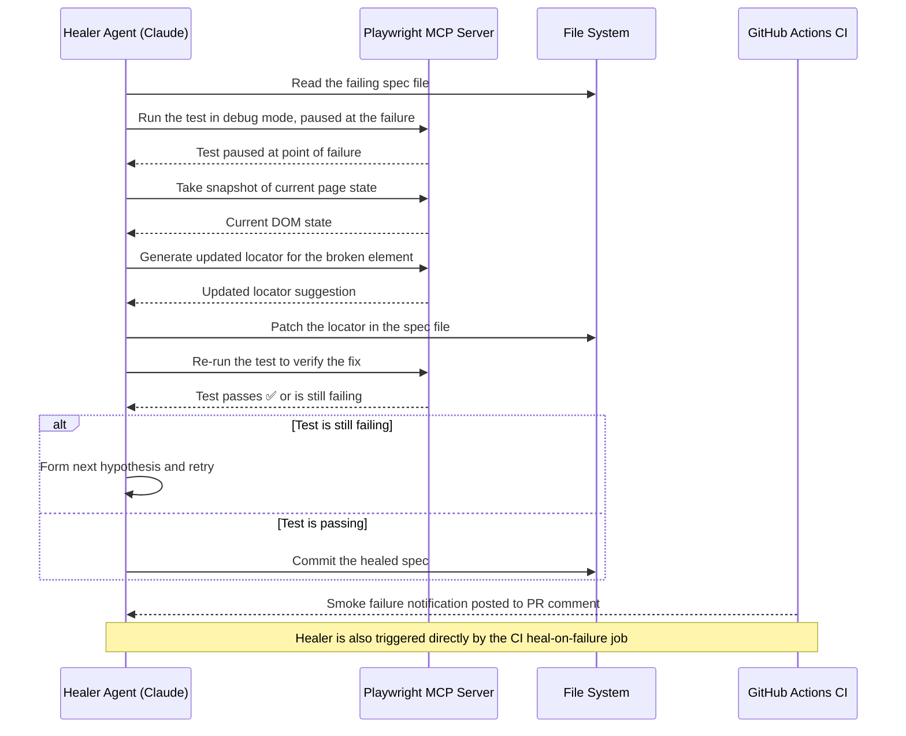

# Agent Pipeline

> **Audience:** Engineers working with the AI agents; QA leads overseeing the automation workflow
> **TL;DR:** Four specialised agents collaborate in a defined sequence — Planner explores the application and creates a test plan, Generator produces Playwright spec files, Reviewer audits quality, and Healer diagnoses and patches failures. Each agent has a bounded role and hands off to the next via files.

## Overview

The agent pipeline replaces the manual cycle of "write a test, watch it fail, guess the locator, retry." Each agent is scoped to what it does best: the Planner explores live UI without writing code, the Generator writes code without navigating a browser, the Reviewer reads without executing, and the Healer fixes without inventing new tests. The handoff artefact between stages is always a file — a test plan `.md` or a spec `.ts` — which means any stage can be re-run independently.

---

## Pipeline overview

```mermaid
flowchart LR
    H(["👤 QA Engineer"])
    P["🗺️ Planner\nplaywright-test-planner"]
    G["⚙️ Generator\nplaywright-test-generator"]
    R["🔍 Reviewer\nplaywright-test-healer"]
    He["🩹 Healer\nplaywright-test-healer"]
    CI["🔄 CI Pipeline\nGitHub Actions"]

    H -->|"Provides .feature file\nor URL to explore"| P
    P -->|"Saves test plan .md\nvia planner_save_plan"| G
    G -->|"Writes spec .ts\nvia generator_write_test"| R
    R -->|"Flags locator or\nassertion failures"| He
    He -->|"Patches spec .ts\nHealed test committed"| CI
    CI -->|"Smoke failure:\nposts healer instructions"| He
```

---

## Stage 1 — Planner (`playwright-test-planner`)

The Planner explores the application under test in a live browser and produces a structured test plan. It never writes TypeScript — its sole output is a Markdown plan file.

**Transport:** Playwright MCP server (`npx playwright run-test-mcp-server`)

**Trigger:** QA engineer provides a URL or a `.feature` file describing the scenario to cover.

**What it does:**

**Output:** `specs/plan.md` — a structured Markdown document with test scenarios, step-by-step instructions, expected outcomes, and starting state assumptions.

**Golden rule compliance:** The Planner uses `browser_snapshot()` (accessibility tree) rather than screenshots. This produces role-based element descriptions that align with `getByRole()` locator strategy.

---

## Stage 2 — Generator (`playwright-test-generator`)

The Generator reads the test plan and produces Playwright TypeScript spec files. It opens a browser to verify each step as it writes it — generating test code and executing it simultaneously.

**Transport:** Playwright MCP server (`npx playwright run-test-mcp-server`)

**Trigger:** Test plan `.md` file produced by the Planner (or written manually).

**What it does:**

**Output:** `tests/<scenario-name>.spec.ts` — a complete Playwright spec using Page Objects from `pages/`, fixtures from `fixtures/index.ts`, and `getByRole()` locators throughout.

**Key constraint:** The Generator reads `skills/SKILL.md` before writing any code. This ensures generated tests use the correct locator hierarchy, fixture injection pattern, and assertion style — not Playwright defaults that may violate framework rules.

---

## Stage 3 — Reviewer (`playwright-test-healer` in review mode)

The Reviewer reads generated spec files and runs the test suite to identify failures. It does not modify code in this stage — it diagnoses and produces a failure report.

**Transport:** Playwright MCP server (`test_run`, `test_debug`, `browser_generate_locator`)

**Trigger:** New or modified spec files committed to the repository.

**What it does:**

**Output:** Annotated failure analysis — broken locators identified, root cause categorised (locator changed / timing issue / assertion mismatch / data dependency).

---

## Stage 4 — Healer (`playwright-test-healer`)

The Healer receives the failure analysis and patches the spec file. It operates on one failure at a time, verifying the fix before moving to the next.

**Transport:** Playwright MCP server + `edit` tool (direct file editing)

**Trigger:** Failure report from Reviewer, or CI `heal-on-failure` job posting failure context.

**What it does:**

**CI integration:** When the `bdd-smoke` CI job fails, a `heal-on-failure` job automatically posts instructions to the PR or opens a GitHub Issue with the run ID and trace download command. The engineer then invokes the Remote Healer agent (`playwright-remote-healer`) with the run ID to download traces and begin healing without leaving VS Code.

**Healer rule:** If a test cannot be healed after exhausting hypotheses and the agent has high confidence the test logic is correct, it marks the test as `test.fixme()` with a comment explaining the observed vs expected behaviour. This prevents flaky tests from blocking CI while the root cause is investigated.

---

## Agent capability matrix

| Agent                        | Reads files         | Writes files      | Runs browser | Runs tests | Edits code |
| ---------------------------- | ------------------- | ----------------- | ------------ | ---------- | ---------- |
| `playwright-test-planner`    | ✓ (plan output)     | ✓ (saves plan)    | ✓            | —          | —          |
| `playwright-test-generator`  | ✓ (plan, SKILL.md)  | ✓ (spec files)    | ✓            | —          | —          |
| `playwright-test-healer`     | ✓ (spec files)      | ✓ (via edit tool) | ✓            | ✓          | ✓          |
| `playwright-remote-healer`   | ✓ (traces, specs)   | ✓ (via edit tool) | ✓            | ✓          | ✓          |
| `framework-template-builder` | ✓ (whole repo)      | ✓ (template/)     | —            | —          | ✓          |
| `technical-writer`           | ✓ (source + skills) | ✓ (docs/ only)    | —            | —          | —          |

---

## Related

- [Agent interactions](agent-interactions.md) — how the QA engineer works with each agent day-to-day
- [Component map](component-map.md) — what files each agent reads and writes
- [Tools and integrations](tools-and-integrations.md) — Playwright MCP server, Claude Code, Copilot
- [CI/CD — GitHub Actions](../05-ci-cd/github-actions.md) — heal-on-failure job and pipeline sequence
