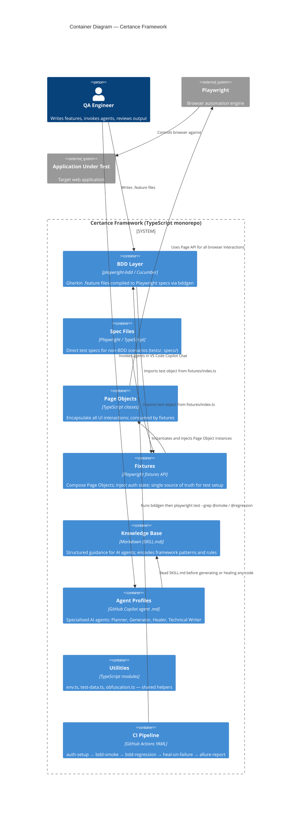
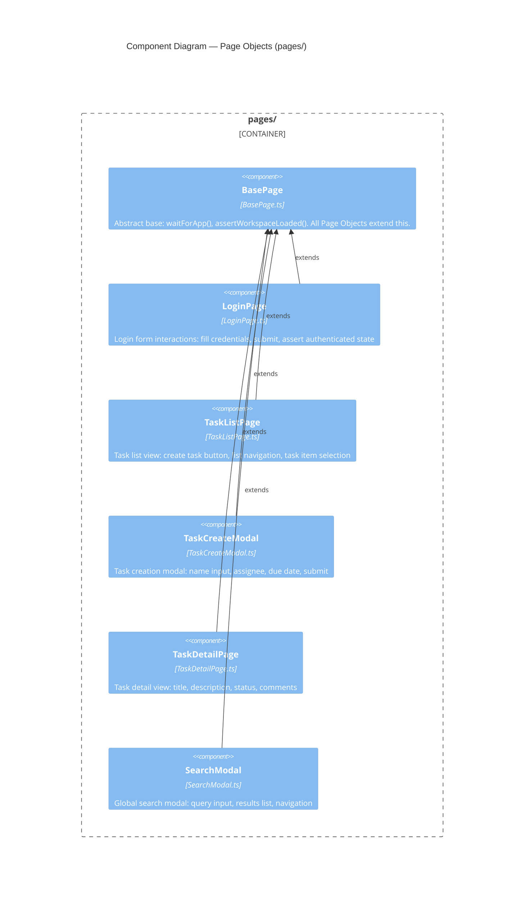
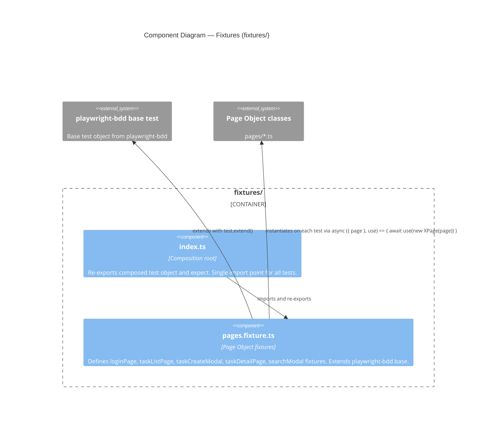
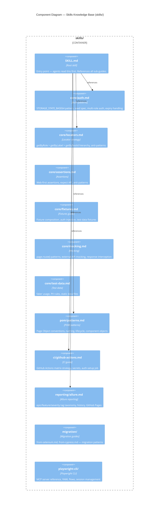
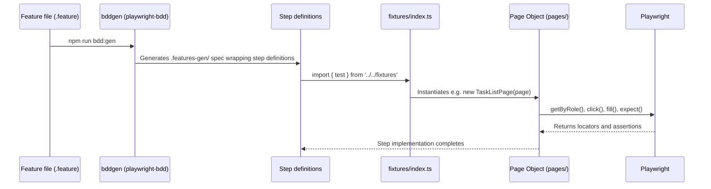

# Component Map

> **Audience:** Engineers and QA leads who need to understand what the framework contains and how the parts fit together
> **TL;DR:** The framework has four runtime components (Page Objects, Fixtures, BDD Layer, Tests) and two support systems (Skills knowledge base, AI Agents). They compose via TypeScript imports and Playwright fixtures — nothing is hidden or magic.

## Overview

The Certance framework is a single TypeScript monorepo. There are no micro-services, no separate deployables, and no runtime infrastructure beyond a browser. The complexity is in the composition: Page Objects encapsulate UI interactions, Fixtures wire Page Objects into tests, the BDD layer translates Gherkin into Playwright calls, and the Skills knowledge base gives AI agents the judgment to generate correct code.

---

## Container diagram

---

## Component diagram — Page Objects layer

Six Page Object classes, all extending `BasePage`. Every class receives a `Page` instance through the constructor — never created directly in tests (fixtures handle that).

---

## Component diagram — Fixtures layer

Two fixture files compose into a single `test` export. `pages.fixture.ts` wires every Page Object. `index.ts` is the composition root — all tests and step definitions import from here.

---

## Component diagram — Skills knowledge base

The knowledge base is consumed exclusively by AI agents. It is never imported by TypeScript code. Each skill file is a structured Markdown document with YAML frontmatter declaring when it applies.

---

## How the layers compose at test execution time

---

## Related

- [Overview](overview.md) — system context and external actors
- [Agent pipeline](agent-pipeline.md) — how agents interact with this component structure
- [Framework structure — Page Objects](../03-framework-structure/page-objects.md) — per-class documentation
- [Framework structure — Fixtures](../03-framework-structure/fixtures.md) — fixture usage guide
