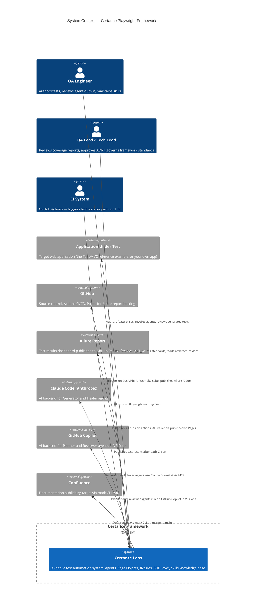

# Architecture Overview

> **Audience:** All — engineers, QA leads, and engineering leadership
> **TL;DR:** The Certance framework is an AI-native Playwright test system where four specialised agents collaborate to plan, generate, review, and heal automated tests — eliminating the manual effort that makes enterprise test suites fragile.

## Overview

Enterprise test automation fails not because engineers lack skill, but because the feedback loop between application change and test maintenance is too slow and too manual. The Certance framework addresses this by embedding AI agents directly into the testing lifecycle: one agent plans, one generates, one reviews, and one heals — each with a defined scope, toolset, and handoff protocol.

The framework is built on Playwright and TypeScript with a BDD layer (Gherkin + Cucumber), deployed on GitHub Actions CI, and reported through Allure. Every design decision is encoded in a structured knowledge base (`skills/`) that agents read before acting, ensuring consistent output across engineers and engagements.

---

## System context

The diagram below shows the Certance framework in its operating environment: who interacts with it, what external systems it depends on, and what it produces.

---

## What the framework is not

Understanding the boundary prevents common misuse:

| Not in scope                | Why                                                                                |
| --------------------------- | ---------------------------------------------------------------------------------- |
| Unit or component testing   | Playwright tests browser interactions; use Vitest/Jest for unit tests              |
| API testing in isolation    | `page.route()` is used for mocking only; dedicated API testing is a separate layer |
| Performance or load testing | Use k6 or equivalent; Playwright is not a load testing tool                        |
| Manual test management      | The framework automates execution; test case management (Jira, Xray) is separate   |

---

## Quality outcomes

The framework exists to solve three measurable business problems:

| Problem                                          | How the framework addresses it                                                                                                         |
| ------------------------------------------------ | -------------------------------------------------------------------------------------------------------------------------------------- |
| Fragile test suites that break on every release  | AI Healer agent detects and patches broken locators automatically; web-first assertions eliminate timing failures                      |
| Coverage that nobody trusts                      | BDD Gherkin features are the source of truth — business scenarios map directly to test execution                                       |
| Test maintenance cost that scales with headcount | Agent pipeline generates and heals tests; knowledge base (SKILL.md) encodes judgment so junior engineers produce senior-quality output |

---

## Related

- [Component map](component-map.md) — internal structure: Page Objects, fixtures, BDD layer, skills
- [Agent pipeline](agent-pipeline.md) — how Planner, Generator, Reviewer, and Healer collaborate
- [Tools and integrations](tools-and-integrations.md) — Playwright, Claude Code, Copilot, Allure, GitHub Actions
- [Goals and requirements](../01-introduction/goals-and-requirements.md) — why this framework exists
