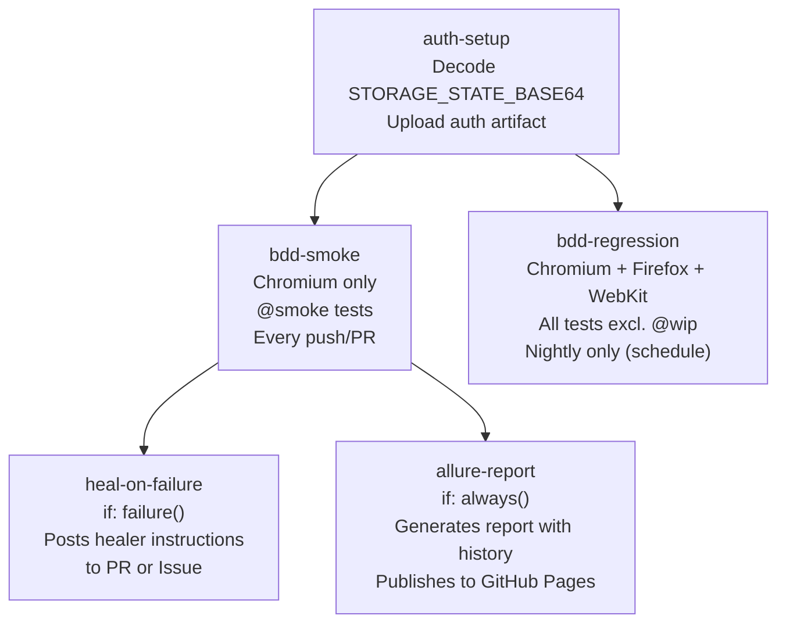
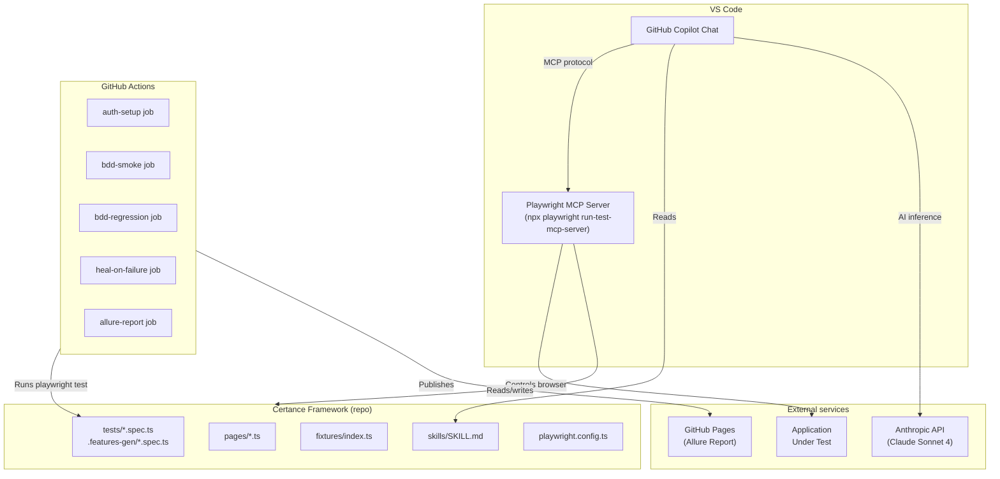

# Tools and Integrations

> **Audience:** Engineers setting up the framework or onboarding to a new engagement; QA leads evaluating the toolchain
> **TL;DR:** The framework is built on six tools — Playwright, TypeScript, playwright-bdd, GitHub Actions, Allure, and the AI agent layer (Claude Code + GitHub Copilot). Each has a defined role; none is optional.

## Overview

Tool selection in the Certance framework is governed by one principle: every tool must earn its place by solving a problem that cannot be solved by another tool already in the stack. This page documents each tool's role, version, configuration location, and the ADR explaining why it was chosen over alternatives.

---

## Tool inventory

| Tool                    | Version                                  | Role                                                              | Config location                                |
| ----------------------- | ---------------------------------------- | ----------------------------------------------------------------- | ---------------------------------------------- |
| Playwright              | `^1.58.2`                                | Browser automation engine and test runner                         | `playwright.config.ts`                         |
| TypeScript              | `^6.0.2`                                 | Type-safe language for all framework code                         | `tsconfig.json`                                |
| playwright-bdd          | `^8.5.0`                                 | BDD layer — compiles Gherkin `.feature` files to Playwright specs | `playwright.config.ts` (via `defineBddConfig`) |
| allure-playwright       | `^3.6.0`                                 | Test reporter — publishes results to Allure dashboard             | `playwright.config.ts` (reporter array)        |
| dotenv                  | `^17.3.1`                                | Environment variable management                                   | `.env` file, loaded in `playwright.config.ts`  |
| GitHub Actions          | N/A                                      | CI/CD pipeline — runs tests on push/PR, publishes Allure report   | `.github/workflows/playwright.yml`             |
| GitHub Copilot          | Claude Sonnet 4                          | Planner and Reviewer agents in VS Code                            | `.github/agents/*.agent.md`                    |
| Claude Code (Anthropic) | Claude Sonnet 4                          | Generator and Healer agents — code generation and locator healing | `.github/agents/*.agent.md`                    |
| Playwright MCP Server   | via `npx playwright run-test-mcp-server` | Transport layer for all Playwright-using agents                   | Agent profile `mcp-servers` config             |

---

## Playwright

**Role:** The automation engine. Every browser interaction in the framework — `click()`, `fill()`, `expect()` — is a Playwright API call. Playwright is also the test runner (`playwright test`).

**Why Playwright over Selenium or Cypress:** Playwright has native support for web-first assertions (auto-retry until the assertion passes or times out), built-in accessibility tree snapshots (used by agents for locator generation), and a modern fixtures API that enables the composition pattern used in `fixtures/`. Cypress is browser-limited; Selenium lacks the modern assertion model.

**Key configuration in `playwright.config.ts`:**

```typescript
use: {
  baseURL: process.env.BASE_URL || 'http://localhost:3000',
  trace: 'retain-on-failure',       // traces saved only on test failure
  screenshot: 'only-on-failure',    // screenshots saved only on failure
  video: 'on-first-retry',          // video recorded on first retry
  testIdAttribute: 'data-test',     // data-test= attribute for getByTestId()
  navigationTimeout: 60_000,        // 60s for page navigations
  actionTimeout: 30_000,            // 30s for individual actions
}
```

**Parallelism:** `fullyParallel: true` with `workers: 4` in CI. Tests must be independent — no shared state between tests.

**Retries:** `retries: 2` in CI, `retries: 0` locally. A test that requires more than 2 retries to pass is unstable and must be investigated.

---

## TypeScript

**Role:** Type safety for all Page Objects, fixtures, utilities, and step definitions. The compiler catches class interface mismatches, incorrect fixture usage, and missing method implementations before tests run.

**Key tsconfig settings:** `strict: true` is enforced. All Page Objects must type their constructor parameters and public method signatures — no `any` types in the public API.

---

## playwright-bdd

**Role:** Bridges Gherkin `.feature` files and Playwright test runner. The `bddgen` compiler reads `features/**/*.feature` and `features/step-definitions/**/*.ts` and generates executable specs in `.features-gen/`.

**BDD project configuration:**

```typescript
// playwright.config.ts
const bddOutputDir = defineBddConfig({
  features: 'features/**/*.feature',
  steps: ['features/step-definitions/**/*.ts', 'fixtures/index.ts'],
});
```

**BDD projects in the runner:**

```typescript
{ name: 'bdd:chromium', testDir: bddOutputDir, use: { ...devices['Desktop Chrome'], storageState: 'test-data/.auth/user.json' } }
```

**Tag convention:**

| Tag           | Meaning                                   | CI behaviour                             |
| ------------- | ----------------------------------------- | ---------------------------------------- |
| `@smoke`      | Critical path — must pass on every commit | Runs in `bdd-smoke` job on every push/PR |
| `@regression` | Full suite                                | Runs in `bdd-regression` job nightly     |
| `@wip`        | Work in progress — excluded from CI       | Skipped via `--grep-invert @wip`         |

---

## Allure Reporter (`allure-playwright`)

**Role:** Structured test reporting with history tracking and GitHub Pages publishing. Allure is the primary dashboard for QA leads and engineering leadership — not the Playwright HTML report.

**Configuration in `playwright.config.ts`:**

```typescript
[
  'allure-playwright',
  {
    outputFolder: 'allure-results',
    suiteTitle: false,
    environmentInfo: {
      framework: 'Certance Playwright Framework v1.0',
      node_version: process.version,
      base_url: process.env.BASE_URL || 'http://localhost:3000',
    },
  },
];
```

**Tag taxonomy for Allure:** Every test must be tagged with:

| Allure tag  | Purpose            | Example                                                       |
| ----------- | ------------------ | ------------------------------------------------------------- |
| `@epic`     | Product area       | `@epic:TaskManagement`                                        |
| `@feature`  | Feature under test | `@feature:TaskCreation`                                       |
| `@severity` | Business impact    | `@severity:critical` / `@severity:normal` / `@severity:minor` |

**CI publishing:** The `allure-report` CI job runs after `bdd-smoke`, generates the report with history from the `gh-pages` branch, and publishes to GitHub Pages. History is preserved across 30 runs.

---

## GitHub Actions CI pipeline

**Role:** Automated test execution on every push and PR, nightly regression, healer trigger on failure, and Allure report publishing.

**Pipeline sequence:**



**Required GitHub Secrets:**

| Secret                 | Purpose                                  |
| ---------------------- | ---------------------------------------- |
| `BASE_URL`             | Application base URL                     |
| `APP_LIST_URL`         | Application list/workspace URL           |
| `STORAGE_STATE_BASE64` | Base64-encoded auth state JSON           |
| `TEST_USER_EMAIL`      | Test user credentials (for BDD env vars) |
| `TEST_USER_PASSWORD`   | Test user credentials (for BDD env vars) |

**Concurrency control:** `cancel-in-progress: true` — if a new push arrives on the same branch, the in-progress run is cancelled. This prevents queue build-up on active branches.

---

## AI agent layer

### GitHub Copilot (Planner, Reviewer)

**Role:** Interactive AI assistant in VS Code. Hosts the Planner and Reviewer agents. Reads agent profiles from `.github/agents/` and workspace instructions from `.github/copilot-instructions.md`.

**Model:** Claude Sonnet 4 (configured in each agent profile).

**Agent transport:** Playwright MCP server (`npx playwright run-test-mcp-server`) is declared in each agent's `mcp-servers` config block. VS Code starts the MCP server automatically when the agent is selected.

### Claude Code / Claude in Cowork (Generator, Healer, Technical Writer)

**Role:** Agentic file-reading and code-writing. The Generator and Healer agents use Claude Code for bulk file operations, multi-file context, and iterative code generation. The Technical Writer agent runs in Claude Cowork mode (this session).

**Key difference from Copilot:** Claude Code can read and write multiple files simultaneously in a single operation, making it more effective for bulk test generation and documentation generation than Copilot's one-file-at-a-time model.

### Playwright MCP Server

**Role:** Transport layer exposing Playwright browser control as MCP tools. Agents call `browser_snapshot()`, `browser_click()`, `test_run()` etc. via the MCP protocol rather than running Playwright directly.

**Starting the server:**

```bash
npx playwright run-test-mcp-server
```

**The server is started automatically** by VS Code when a Playwright agent is selected, via the `mcp-servers` config in each agent profile. No manual startup required in normal usage.

---

## Integration diagram



---

## Related

- [Overview](overview.md) — system context diagram showing all external dependencies
- [Agent pipeline](agent-pipeline.md) — how agents use these tools in sequence
- [CI/CD — GitHub Actions](../05-ci-cd/github-actions.md) — full pipeline configuration reference
- [CI/CD — Auth setup](../05-ci-cd/auth-setup.md) — STORAGE_STATE_BASE64 pattern and rotation
- [CI/CD — Reporting](../05-ci-cd/reporting.md) — Allure tag taxonomy and history
